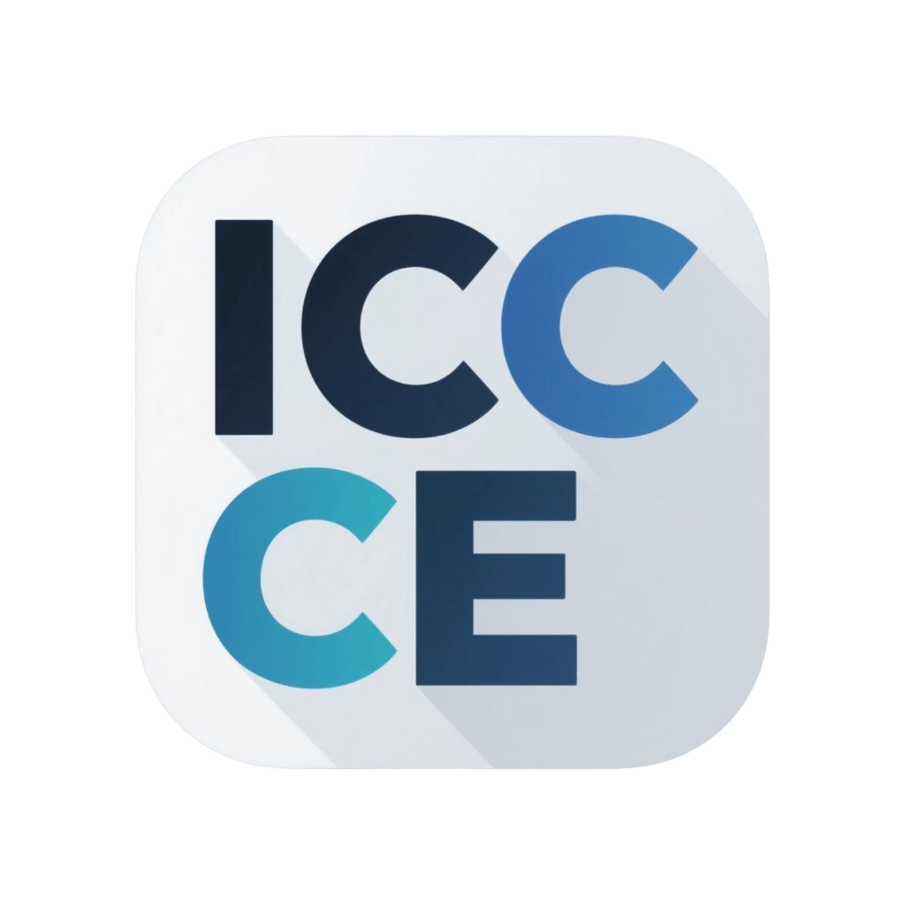

# InkCanvasForClass Community Edition

最后一次基于 `InkCanvas` 控件的倔强...

# 社区准则

> 本准则适用于 ICC-CE [QQ 群](https://qm.qq.com/q/qo32AclNh6)、[Discord 社区](https://discord.gg/ahj7eJWhEG)、[智教论坛](https://forum.smart-teach.cn/t/icc-ce)及其他相关社区。

## ICC-CE 贡献者
> [!NOTE]
>
> 此列表通过[All Contributers](https://allcontributors.org/)实现。

<!-- ALL-CONTRIBUTORS-LIST:START - Do not remove or modify this section -->
<!-- prettier-ignore-start -->
<!-- markdownlint-disable -->
<table>
  <tbody>
    <tr>
      <td align="center" valign="top" width="14.28%"><a href="https://github.com/CJKmkp"> <b>CJK_mkp</b></a> <a href="#maintenance-CJKmkp" title="Maintenance">🚧</a></td>
      <td align="center" valign="top" width="14.28%"><a href="https://github.com/Hydro11451"> <b>Hydrogen</b></a> <a href="#maintenance-Hydro11451" title="Maintenance">🚧</a></td>
    </tr>
  </tbody>
</table>

<!-- markdownlint-restore -->
<!-- prettier-ignore-end -->

<!-- ALL-CONTRIBUTORS-LIST:END -->
